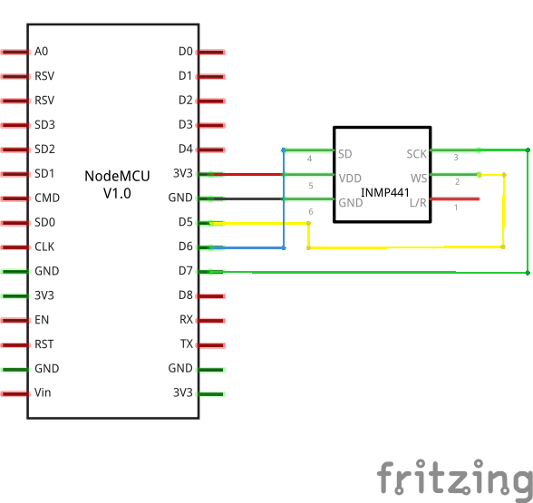

# ESP8266-BUG-I2S-MIC

## Very simple bug with ESP8266 and I2S MEMS microphone for listening and recording Audio via UDP.

The main.cpp file in the src folder was written for PlatformIO, but it is possible to convert it for Arduino IDE.

You just need to change the file extension from cpp to ino and delete "#include <Arduino.h>".

The project is very simple and requires only a few connections.

#### Below you can find the connection diagram for NodeMCU.

You needs a UDP listener like netcat on port 16500 ( in according with sketch ) on listener PC.

The command to run on the Linux terminal for live audio streaming is:

### "netcat -u -p 16500 -l | play -t raw -r 16000 -b 16 -c 2 -e signed-integer -" without quotes !
#### you can also use this instruction instead of the previous one
### "netcat -u -p 16500 -l | play -t s16 -r 16000 -c 2 -" without quotes !
You needs a SoX utility with mp3 handler for Recorder

Under Linux for recorder (give for file.mp3 the name you prefer).

The command to run on the Linux terminal for rec audio streaming is:

### "netcat -u -p 16500 -l | rec -t raw -r 16000 -b 16 -c 2 -e signed-integer - file.mp3" without quotes !
#### you can also use this instruction instead of the previous one
### "netcat -u -p 16500 -l | rec -t s16 -r 16000 -c 2 - file.mp3" without quotes !

#### Set your listener PC's IP here in according with your DHCP network. In my case is 192.168.1.40:
##### const IPAddress listener = { 192, 168, 1, 40 };

#### Set the UDP port you prefer. In my case:
##### const int port = 16500;

