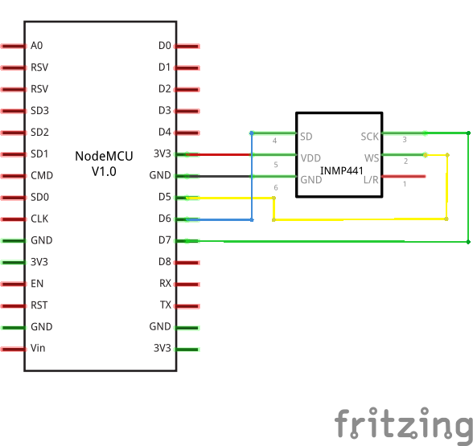
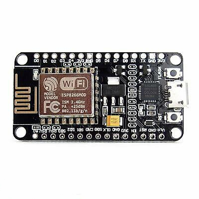

# ESP8266-BUG-I2S-MIC

Simple project for live audio streaming and recording from an I2S MEMS microphone (INMP441) over UDP, using an ESP8266 (NodeMCU). The ESP8266 reads stereo 16-bit samples from the microphone via I2S and transmits them as raw UDP packets to a listener PC on the local network.

The `main.cpp` file in the `src` folder is written for PlatformIO. To use it with the Arduino IDE, rename the file from `.cpp` to `.ino` and remove the line `#include <Arduino.h>`.

---

## Wiring






---

## Dependencies

- `ESP8266WiFi.h` — Wi-Fi connectivity
- `WiFiUdp.h` — synchronous UDP socket
- `I2S.h` — I2S peripheral driver for ESP8266

---

## Configuration

Before flashing, edit the following values in `main.cpp`.

Wi-Fi credentials:

```cpp
#define STASSID "YOUR_SSID"
#define STAPSK  "YOUR_PASS"
```

IP address of the listener PC (must match your DHCP network):

```cpp
const IPAddress listener(192, 168, 1, 40);
```

UDP port (default: 16500):

```cpp
const int port = 16500;
```

---

## How it works

After connecting to Wi-Fi, the sketch initialises the I2S peripheral in receive-only mode (`i2s_rxtx_begin(true, false)`) at 16000 Hz. A small handshake packet containing the string `I2S Receiver` is sent to the listener address at startup to confirm connectivity.

In the main loop, 100 stereo 16-bit samples are read synchronously into a fixed buffer of 100 × 2 × `int16_t` (400 bytes) using `i2s_read_sample()`. The entire buffer is then sent as a single UDP packet. The 400-byte packet size is intentionally kept below the LWIP v2 TCP_MSS limit of approximately 500 bytes to avoid fragmentation. A counter is printed to the serial monitor every 100 packets as a basic activity indicator.

Audio format: raw PCM, 16000 Hz, 16-bit signed integer, 2 channels (stereo).

---

## Requirements

A UDP listener on the receiving PC is required. Install [SoX](https://sox.sourceforge.net/) with MP3 handler support for recording.

---

## Usage

All commands below assume the default port `16500`. Replace the IP and port if you changed them in the sketch. The listener command must be started on the PC before the ESP8266 begins transmitting.

### Live audio streaming (Linux)

```bash
netcat -u -p 16500 -l | play -t raw -r 16000 -b 16 -c 2 -e signed-integer -
```

Alternative shorthand:

```bash
netcat -u -p 16500 -l | play -t s16 -r 16000 -c 2 -
```

### Record to file (Linux)

Replace `file.mp3` with your preferred filename. SoX with MP3 handler is required.

```bash
netcat -u -p 16500 -l | rec -t raw -r 16000 -b 16 -c 2 -e signed-integer - file.mp3
```

Alternative shorthand:

```bash
netcat -u -p 16500 -l | rec -t s16 -r 16000 -c 2 - file.mp3
```

### Serial monitor

The sketch logs its startup sequence and connection status at 115200 baud:

```
Connecting to YOUR_SSID
.....
WiFi connected
My IP: 192.168.1.xx
Start the listener on 192.168.1.40:16500
```

Once streaming, the packet counter is printed every 100 packets.

---

## License

MIT License — Copyright (c) 2021 Alessandro Orlando.
